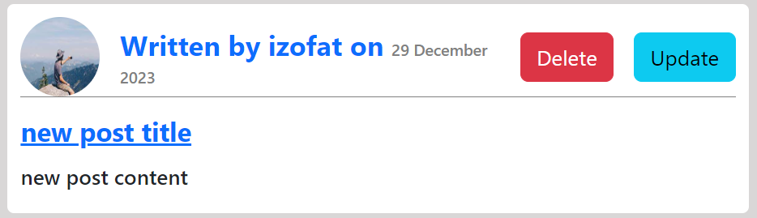
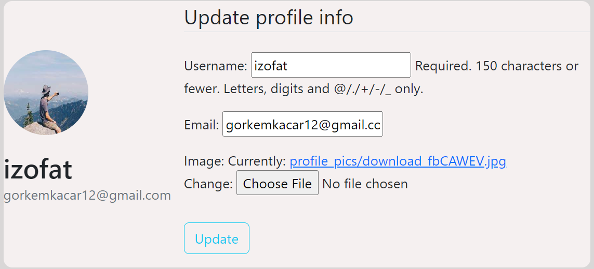

A blog application that you can post blog and set your profile

# Login && Register

 
 

# Main Page

# Create Post

# Post Detail

You can see the details of the post 

# Post Delete && Update

# Profile

# Announcements
Only admins can add announcement 

Admins can add announcements in the admin panel

# Latest Posts

Latest posts page shows the last 4 post that created

# All Post User

You can see all the post that user posted by clicking it's name 

# Password Reset

